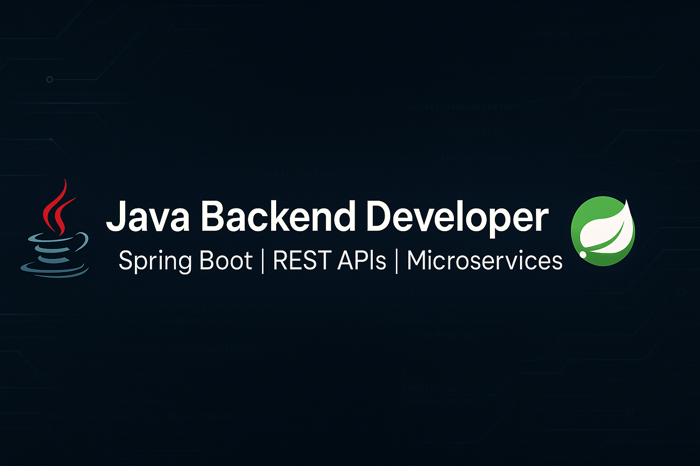

  

<!-- Perfil GitHub README -->

<h1 align="center">Olá! Sou Diego ✨</h1>

  Estudante de desenvolvimento back‑end Java, focado em Spring Boot, APIs REST, microservices e boas práticas de Clean Code e SOLID.

  <!-- Badges de tecnologias -->
  
  
  
  
  
  
  

---

### Sobre mim
Sou apaixonado por tecnologia e atualmente estou me dedicando ao estudo de **Java** e **Spring Boot** com foco no desenvolvimento back‑end. Tenho grande interesse em APIs REST, microserviços, arquitetura limpa, princípios **SOLID** e testes automatizados.

- **Aprendendo:** Spring Boot, Java 17+, Spring Security, Docker/Kubernetes, AWS
- **Ferramentas:** Git, Maven, Gradle, CI/CD (GitHub Actions), IDEs (IntelliJ IDEA)
- **Objetivo:** conquistar certificações Java e ingressar em projetos back‑end

### Contato

  
  
  

---
