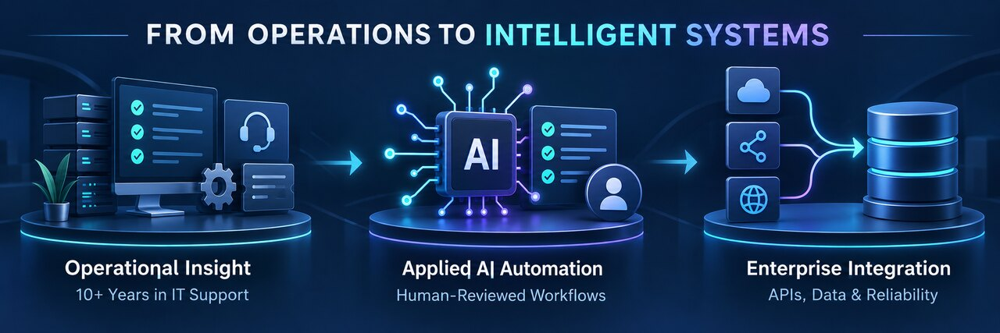

# Diego Gabriel dos Santos

### IT Support & Systems Professional | Applied AI Automation · Backend APIs · Enterprise Integrations

Building secure, traceable software that connects AI capabilities to real operational workflows.

## About me

I am an **IT Support and Systems professional with 10+ years of experience** in healthcare, enterprise and industrial environments. My background spans L2 support, business-critical ERP systems, Windows and Active Directory, infrastructure, networking, databases, incident management and technical documentation.

I now apply that operational foundation to **AI-assisted automation, backend APIs and enterprise integration solutions**. My differentiator is the ability to connect software engineering with the realities of production support: security, traceability, human approval, reliability and clear communication.

- **Today:** IT Support & Systems professional delivering reliable technical operations
- **Building:** production-minded projects in applied AI, APIs, automation and data integration
- **Direction:** international opportunities in Applied AI Engineering, AI Solutions Engineering and AI Backend Engineering

## Core stack

| Focus | Technologies and practices |
|---|---|
| Applied AI | scikit-learn, TF-IDF, retrieval, structured outputs, human-in-the-loop workflows |
| APIs & integration | REST, OpenAPI, SOAP contracts, WSDL, XSD, JSON, XML |
| Backend & data | Python, FastAPI, PostgreSQL, SQLAlchemy, Alembic, Cloudflare D1 |
| Frontend & cloud | TypeScript, React, Cloudflare Workers, Auth0 |
| Quality & reliability | Pytest, Vitest, Playwright, CI, audit trails, authorization, concurrency control |

## Featured projects

### [DeskPilot — AI-assisted IT Service Desk Automation](https://github.com/diegodgspro/ai-it-service-desk-copilot)

A production-oriented portfolio project that transforms synthetic support incidents into structured intake drafts, evidence-led troubleshooting guidance and human-reviewed action simulations.

**Highlights:** React + TypeScript · Cloudflare Workers + D1 · Auth0 with PKCE · Python classification and retrieval lab · append-only audit events · automated API, frontend and browser tests

> DeskPilot uses synthetic incidents and simulated automation. Its production web application does not currently use an external LLM or perform unattended remediation.

### [Enterprise Integration Hub — REST, Contracts & Persistence](https://github.com/diegodgspro/enterprise-integration-hub)

A healthcare integration portfolio demonstrating how modern REST consumers and legacy SOAP contracts can share transport-independent business rules.

**Highlights:** Python + FastAPI · PostgreSQL + SQLAlchemy · Alembic migrations · OpenAPI, WSDL and XSD contracts · ports-and-adapters architecture · correlation IDs · automated domain, API and persistence tests

> The REST and persistence layers are implemented. SOAP contracts are versioned, while the executable SOAP adapter remains on the roadmap.

## What I am building toward

- LLM integration with schema-bound outputs, evaluation datasets and regression gates
- Tool calling with explicit permissions, evidence grounding and human approval
- Retrieval with embeddings and vector search
- AI observability across quality, tracing, latency and cost
- Asynchronous workflows and production-grade backend services

## Professional direction

I am preparing for **international opportunities in Applied AI Engineering, AI Solutions Engineering and AI Backend Engineering**, especially where AI must integrate safely with real business systems and operational workflows.

### Let's connect

